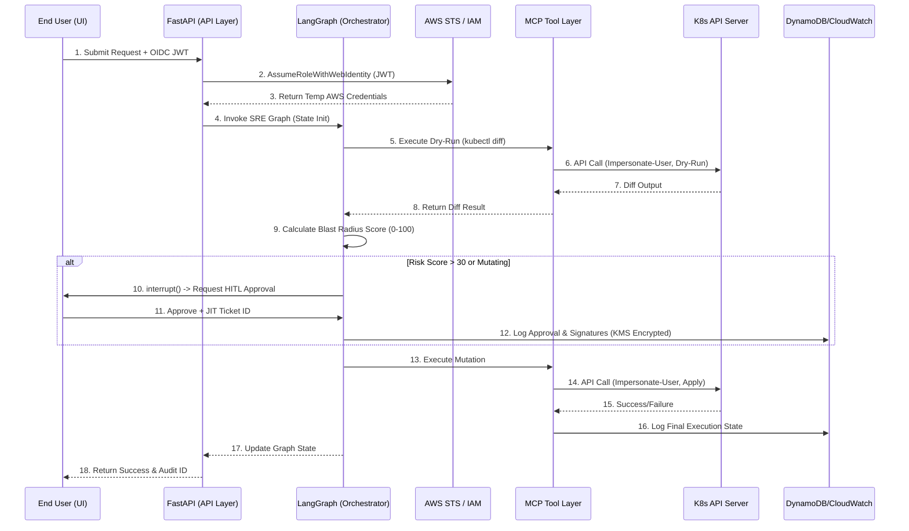

# Architecture & Security Flow

## 1. ASCII Architecture Diagram

```text
+-----------------------------------------------------------------------------------+
|                            ENTERPRISE K8s SRE AI AGENT                            |
+-----------------------------------------------------------------------------------+
|  [Google Stitch UI]                                                               |
|  - Auth/OIDC Login                                                                |
|  - ClusterSelector, DiffViewer, ApprovalModal                                     |
+------------------------------------+----------------------------------------------+
                                     | (JWT / OIDC Token)
                                     v
+------------------------------------+----------------------------------------------+
|                          API & PRESENTATION LAYER                                 |
|  [FastAPI / WebSockets]                                                           |
|  - Route HTTP/WS requests                                                         |
|  - Validate OIDC JWT Signature                                                    |
+------------------------------------+----------------------------------------------+
                                     |
+------------------------------------+----------------------------------------------+
|                          ORCHESTRATION LAYER (LangGraph)                          |
|  [State: {tenant_id}:{cluster_id}:{session_id}]                                   |
|   1. Intent Parsing -> 2. Plan -> 3. Dry-Run -> 4. Risk Eval -> 5. HITL Interrupt |
+------------------------------------+----------------------------------------------+
                                     |
+------------------------------------+----------------------------------------------+
|                           TRANSPORT & TOOL LAYER                                  |
|  [AWS STS Handler]        [MCP Client Connector]         [Audit/KMS Logger]       |
|  - AssumeRoleWithWebId    - Dynamic Tool Binder          - DynamoDB + CloudWatch  |
|  - JIT Ticket Validator   - Rate Limiter & Breakers      - Tamper-proof logs      |
+------------------------------------+----------------------------------------------+
                                     |
           +-------------------------+-------------------------+
           |                         |                         |
(Option 1: Agentless/OOB)  (Option 2: Tunnel/Sidecar) (Option 3: Shadow Mode)
           |                         |                         |
           v                         v                         v
+--------------------+   +-----------------------+   +--------------------+
|   AWS EKS Cluster  |   | Private/On-Prem K8s   |   | Any K8s Cluster    |
| (IAM OIDC Trust)   |   | (MCP gRPC Sidecar)    |   | (Read-Only RBAC)   |
| Impersonate-User   |   | Impersonate-User      |   | Audit Logging Only |
+--------------------+   +-----------------------+   +--------------------+
```

## 2. Sequence Diagram (Mermaid)


